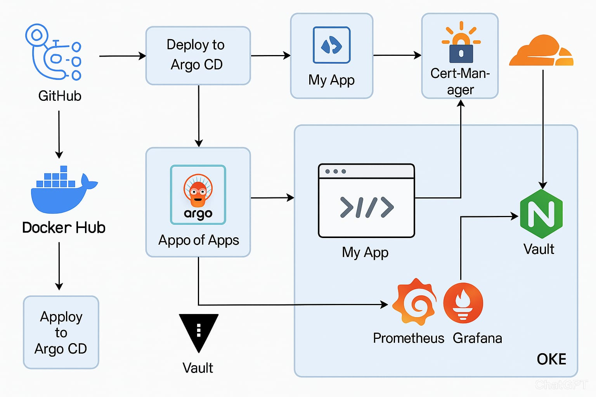

# guiadodevops
Com Terraform, Kuberntes, CI / CD, pipeline com Git Actions, Argo CD, App of apps, Sonar Qube, Granfana, Prometheus, Loki, Trivy, External Secrets, Vault, External DNS, Cloud Flare, Cert Manager, Nginx Ingress Controller usando todo fluxo praticas de DevSecOps.

## CI/CD Pipeline

## Overview

Este projeto demonstra uma implementação completa de práticas DevSecOps incluindo:

- **Infraestrutura como Código**: Terraform para AWS, GCP e OCI
- **Orquestração**: Kubernetes com clusters EKS, GKE e OKE
- **GitOps**: ArgoCD com App of Apps pattern
- **Monitoramento**: Grafana, Prometheus, Loki
- **Segurança**: Trivy, Vault, External Secrets
- **CI/CD**: Jenkins, Git Actions
- **Qualidade**: SonarQube
- **Ingress**: Nginx Ingress Controller
- **DNS**: External DNS com Cloudflare
- **Certificados**: Cert Manager

