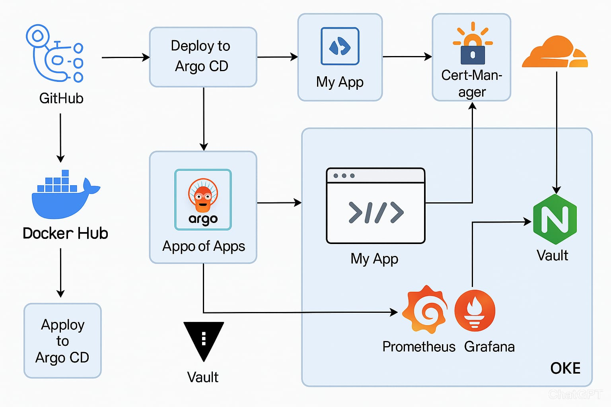

# Devopsguide 2025
With Terraform, Kubernetes, CI/CD, pipeline with Git Actions, Argo CD, App of Apps, Sonar Qube, Granfana, Prometheus, Loki, Trivy, External Secrets, Vault, External DNS, Cloud Flare, Cert Manager, Nginx Ingress Controller, using all DevSecOps workflow practices.

## CI/CD Pipeline

## Overview

This project demonstrates a complete implementation of DevSecOps practices including:

- **Infrastructure as Code**: Terraform for AWS, GCP and OCI
- **Orchestration**: Kubernetes with EKS, GKE and OKE clusters
- **GitOps**: ArgoCD with App of Apps pattern
- **Monitoring**: Grafana, Prometheus, Loki
- **Security**: Trivy, Vault, External Secrets
- **CI/CD**: Jenkins, Git Actions
- **Quality**: SonarQube
- **Ingress**: Nginx Ingress Controller
- **DNS**: External DNS with Cloudflare
- **Certificates**: Cert Manager

