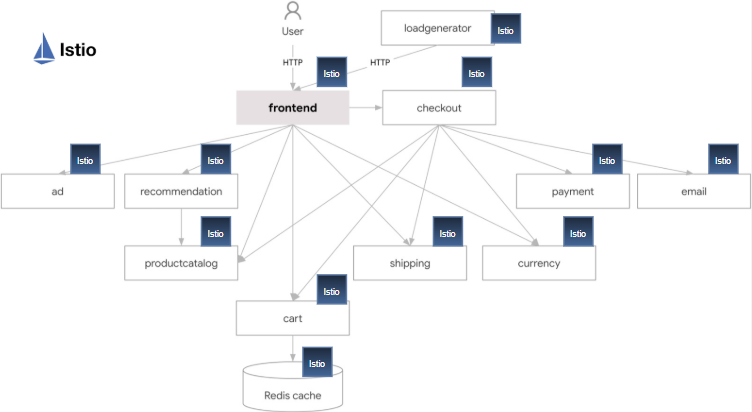

🚀 Istio in action: securing the Boutique microservices app

Recently, I worked on applying Istio service mesh to the Boutique demo app, and here’s how I secured service-to-service communication:

🔹 Sidecar injection
By labeling the boutique namespace with istio-injection=enabled, every pod automatically receives an Envoy sidecar.
Now all traffic flows: app → local Envoy → mTLS → remote Envoy → app.

🔹 Namespace-wide mTLS
A PeerAuthentication set to STRICT ensures all inbound traffic between services must use Istio mTLS.
✅ Encryption in transit
✅ Workload identity via SPIFFE

🔹 Frontend exception for NGINX
Since NGINX Ingress is outside the mesh and speaks plain HTTP, I applied a PeerAuthentication with PERMISSIVE only for pods labeled app: frontend.

External: 🌍 Internet → NGINX → Frontend (plain HTTP accepted)

Internal: Frontend → other services (mTLS enforced)

🔹 DestinationRules with ISTIO_MUTUAL
Each service (adservice, cartservice, productcatalog, etc.) has a DestinationRule with tls.mode: ISTIO_MUTUAL.
This ensures clients always initiate mTLS, perfectly matching the STRICT policy on servers.

🔹 What actually happens

External request: User → NGINX LB → Frontend pod → sidecar accepts plain HTTP (PERMISSIVE).

Service-to-service: Frontend → Productcatalog goes via Envoy sidecars with mTLS enforced.

✨ Result: all internal calls inside Boutique are authenticated + encrypted, while external users can still access the app via NGINX.